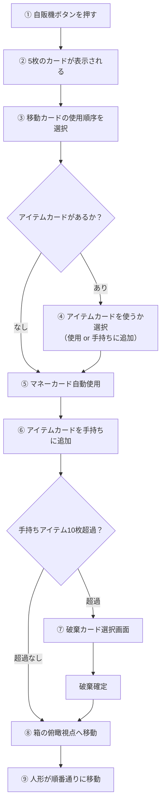
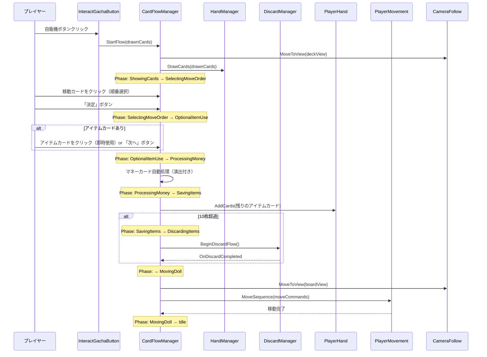

# カードフロー全体リワーク計画書（改訂版 v2）

> **このドキュメントは引き継ぎ用の設計資料です。**
> 実装担当者はこの文書と `AGENTS.md` を必ず参照してから作業を開始してください。

---

## 1. 背景と目的

現在のフローでは、パックから出た5枚のカードをプレイヤーが1枚ずつ自由にクリックして個別に使用する形になっている。
これを、**カード種別ごとの自動処理と最小限の選択操作**を組み合わせた**半自動フロー**へ変更する。

### 前提条件
- パックには**最低1枚の移動カード**が必ず含まれる
- 1パック = 5枚

---

## 2. 新フロー（全体像）



---

## 3. 各フェーズの詳細仕様

### Phase 1: カード展開（ShowingCards）
- `InteractGachaButton` でパック購入 → `CardFlowManager.StartFlow(drawnCards)` を呼ぶ
- カメラが手元（deckView）へ移動
- `HandManager.DrawCards()` で5枚を並べて描画
- 内部で5枚を種別ごとに分類：
  - `moveCards`: List\<MoveCardData\>（最低1枚）
  - `moneyCards`: List\<MoneyCardData\>
  - `itemCards`: List\<ItemCardData\>

### Phase 2: 移動カード順序選択（SelectingMoveOrder）
- UIパネルに「移動カードをクリックして使う順番を決めてください」と表示
- プレイヤーが移動カード（水色）をクリックすると、カード上に順番の番号（①②③...）が表示される
- **再クリックで選択解除**可能（番号がリセットされ、以降のカードも繰り上がる）
- 例: 3枚の移動カードがある場合、3枚すべてに番号が振られたら「決定」ボタンが有効化
- **移動カード以外はこのフェーズではクリック不可**（グレーアウトまたはクリック無視）
- 決定後 → Phase 3 へ

### Phase 3: アイテムカード即時使用選択（OptionalItemUse）
- アイテムカードがない場合 → スキップして Phase 4 へ
- アイテムカードがある場合 → UIに「アイテムカードを今使いますか？ 使わないカードは手持ちに保存されます」と表示
- プレイヤーがアイテムカードをクリックすると、**即座に効果を発動**
  - `AddMoveStep`: 移動ボーナスを加算
  - `Redraw`: ※ このフローでは使用不可（手持ちに保存されるのみ）にするか、要検討
- 使わなかったアイテムカードはそのまま Phase 5 で手持ちに保存される
- 「次へ進む」ボタンで Phase 4 へ（またはアイテムカードが0枚になったら自動遷移）

### Phase 4: マネーカード自動使用（ProcessingMoney）
- マネーカードを1枚ずつ順に処理（短い間隔 0.3秒程度）
- 処理内容: `MoneyManager.AddMoney(amount)`
- **簡易演出**: カードが光って消える（Emission → 0.3秒後に Destroy）
- 全マネーカード処理完了 → Phase 5 へ
- マネーカードがない場合 → スキップして Phase 5 へ

### Phase 5: アイテム保存（SavingItems）
- Phase 3 で**使用しなかった**アイテムカードを `PlayerHand.AddCards()` で追加
- 上限（10枚）超過なら Phase 6 へ
- 超過なし → Phase 7 へ

### Phase 6: アイテム破棄選択（DiscardingItems）
- `DiscardManager.BeginDiscardFlow()` を起動
  - **対象はアイテムカードのみ**（PlayerHand にはアイテムしか入らない設計）
- 破棄完了後、コールバックで Phase 7 へ

### Phase 7: 俯瞰移動（MovingDoll）
- カメラを箱の俯瞰視点（boardViewTarget）へ移動
- カメラ到着を待つ（0.8秒程度）
- `PlayerMovement.MoveSequence(moveCommands)` で Phase 2 で決めた順番通りに人形を動かす
  - 各移動コマンドは `(Direction, Steps)` のペア
  - 1コマンドずつ順番に実行し、完了を待ってから次のコマンドへ
- 全移動完了 → フロー終了（Idle へ戻る）

---

## 4. 新規・変更ファイル一覧

### [NEW] `Assets/Scripts/Managers/CardFlowManager.cs`
フロー全体を制御する中心クラス。ステートマシン方式。

```csharp
public enum CardFlowPhase
{
    Idle,                // 待機中（通常のゲームプレイ）
    ShowingCards,        // パックからカード展開中
    SelectingMoveOrder,  // 移動カード順序選択中
    OptionalItemUse,     // アイテムカード即時使用選択中
    ProcessingMoney,     // マネーカード自動処理中
    SavingItems,         // アイテムカード保存中
    DiscardingItems,     // アイテム破棄選択中（DiscardManagerに委譲）
    MovingDoll           // 俯瞰視点で人形移動中
}
```

**主要メンバ:**
- `CardFlowPhase CurrentPhase` — 現在のフェーズ
- `List<MoveCardData> _moveCards` — パックから出た移動カード
- `List<MoneyCardData> _moneyCards` — パックから出たマネーカード
- `List<ItemCardData> _itemCards` — パックから出たアイテムカード
- `List<(DirectionType, int)> _moveOrder` — 選択された移動順序
- `bool IsInFlow => CurrentPhase != CardFlowPhase.Idle` — フロー中かどうか

**主要メソッド:**
- `StartFlow(List<CardData> drawnCards)` — フロー開始（InteractGachaButton から呼ばれる）
- `OnMoveCardClicked(CardObject card)` — 移動カード順序選択の処理
- `OnItemCardClicked(CardObject card)` — アイテムカード即時使用の処理
- `OnConfirmMoveOrder()` — 移動順序決定ボタン
- `OnProceedFromItems()` — アイテム選択完了ボタン
- `ProcessMoneyCards()` — マネーカード自動処理コルーチン
- `ExecuteMoveSequence()` — 人形移動コルーチン

---

### [MODIFY] `Assets/Scripts/Interactables/InteractGachaButton.cs`

**変更内容:**
- `OnInteract()` 内の処理を簡素化
- パック開封後、`CardFlowManager.Instance.StartFlow(drawnCards)` を呼ぶだけにする
- `HandManager.DrawCards()` の直接呼び出しを削除（`CardFlowManager` 内で行う）

---

### [MODIFY] `Assets/Scripts/Player/CardObject.cs`

**変更内容:**
- `OnInteract()` を全面的にリファクタリング
- `CardFlowManager.CurrentPhase` に応じた処理分岐:
  - `SelectingMoveOrder` → 移動カードのみ反応、`CardFlowManager.OnMoveCardClicked(this)` を呼ぶ
  - `OptionalItemUse` → アイテムカードのみ反応、`CardFlowManager.OnItemCardClicked(this)` を呼ぶ
  - `DiscardingItems` → 既存の `DiscardManager.ToggleSelection(this)` を呼ぶ
  - `Idle`（デッキ展開時） → アイテムカードの通常使用（既存ロジック維持）
- マネーカード・移動カードの個別使用ロジックは `CardFlowManager` へ移管
- **アイテムカードの使用ロジック**（`AddMoveStep` 等）は `CardObject` に残す（デッキ展開→クリック使用を維持するため）

---

### [MODIFY] `Assets/Scripts/Managers/HandManager.cs`

**変更内容:**
- `SaveRemainingCardsToPlayerHand()` のロジックを簡素化（`CardFlowManager` が主導するため）
- レイアウト・描画機能はそのまま維持
- 移動カードの番号表示用に `SetOrderNumber(CardObject card, int number)` メソッドを追加検討

---

### [MODIFY] `Assets/Scripts/Managers/DiscardManager.cs`

**変更内容:**
- 破棄完了後に `CardFlowManager` へ通知するコールバック機構を追加
  - `public System.Action OnDiscardCompleted;` イベント
  - `FinalizeDiscard()` 内でイベントを発火
- 対象がアイテムカードのみであることのガード（PlayerHand にアイテムしか入らないため自動的に対象限定）
- デバッグ用のマニュアルクリック判定は維持

---

### [MODIFY] `Assets/Scripts/Managers/PlayerHand.cs`

**変更内容:**
- **アイテムカードのみ**を保持する設計に変更
- `AddCards()` 内で `CardType.Move` / `CardType.Money` が混入した場合は警告ログを出して無視
- 上限チェックと破棄フローの起動ロジックは維持

---

### [MODIFY] `Assets/Scripts/Player/PlayerMovement.cs`

**変更内容:**
- `MoveSequence(List<(DirectionType, int)> commands)` コルーチンを新規追加
- 各コマンドを順番に実行し、1コマンド完了後に 0.5〜1.0 秒待ってから次を実行
- 全コマンド完了後にコールバック（`CardFlowManager` へ通知）

---

### [MODIFY] `Assets/Scripts/Managers/GameState.cs`

**変更内容:**
- 既存の `PackOpening` ステートを活用（`CardFlowManager` のフロー中 = `PackOpening` ステート）
- フロー開始時に `GameManager.ChangeState(GameState.PackOpening)` を呼ぶ
- フロー終了時に `GameManager.ChangeState(GameState.Preparation)` に戻す

---

## 5. UI 変更

### 移動順序選択UI（新規作成が必要）
- **パネル**: 「移動カードの使用順番をクリックで選んでください」テキスト
- **決定ボタン**: 全移動カードに番号が振られたら有効化
- **リセットボタン**: 選択をすべてクリアして最初からやり直し
- カードの上に番号（①②③...）を表示する仕組み
  - CardObject の子オブジェクトとして TextMeshPro を配置し、番号を動的に設定
  - 番号なし = 未選択、番号あり = 選択済み

### アイテム使用選択UI（新規作成が必要）
- **パネル**: 「アイテムカードをクリックすると即座に使用します。使わないカードは手持ちに保存されます」テキスト
- **次へ進むボタン**: いつでも押せる（アイテムを使わない選択も可能）

### マネーカード処理UI
- 既存のUIで対応可能（MoneyManager の表示が自動更新される前提）
- 簡易演出: カードが光って消えるのみ

### 破棄選択UI（既存流用）
- `DiscardManager` の既存UIをそのまま使用

---

## 6. 処理フローのシーケンス図



---

## 7. 実装の優先順位（推奨順序）

1. **`CardFlowManager.cs` の新規作成**（ステートマシンの骨格）
2. **`InteractGachaButton.cs` の修正**（`CardFlowManager.StartFlow()` への委譲）
3. **移動カード順序選択ロジック**（Phase 2）
4. **マネーカード自動処理ロジック**（Phase 4）
5. **`PlayerMovement.MoveSequence()` の追加**（Phase 7）
6. **アイテムカード即時使用ロジック**（Phase 3）
7. **`PlayerHand.cs` の修正**（アイテムのみ保持）
8. **`DiscardManager.cs` のコールバック追加**（Phase 6）
9. **`CardObject.cs` のリファクタリング**（全フェーズ対応）
10. **UI の作成・調整**（移動順序選択UI、アイテム使用選択UI）

---

## 8. 注意事項（実装者向け）

- `AGENTS.md` に記載されたプロジェクトルールを遵守すること
- **main ブランチへの直接コミットは禁止**。必ず作業ブランチを作成すること
- `.meta` ファイルの扱いに注意（勝手に削除・再生成しない）
- コメントは日本語で記述すること
- 既存の `DiscardManager` のマニュアルクリック判定（`EventSystem` の不整合回避策）は**そのまま維持**すること
- `CardFlowManager.IsInFlow` が `true` の間は、他のインタラクト（カードデッキクリック、自販機、お金等）をすべてブロックすること（既存の `DiscardManager.IsDiscarding` ガードと同様の仕組み）
- `GameState.PackOpening` と連動させ、フロー中は全体のゲームステートも管理すること

---

## 9. 検証計画

### 手動テスト項目
1. 移動カード1枚のパック → 順番選択不要で即決定可能か
2. 移動カード3枚のパック → 3枚に番号を振って決定 → 俯瞰で順番通りに移動するか
3. 移動カード順序のリセット → 番号がクリアされて選び直しできるか
4. マネーカードの自動加算 → 所持金が正しく増えるか
5. アイテムカードの即時使用 → 効果が正しく発動するか
6. アイテムカードの保存 → 手持ちに追加されるか
7. 手持ちアイテム10枚超過 → 破棄選択画面が起動するか
8. 全フロー完了 → Idle に戻り、通常操作が可能か
9. フロー中に ESC キーや他のクリックが無効かどうか
10. デッキ展開（カードの束クリック）からのアイテム使用が正常に動作するか
